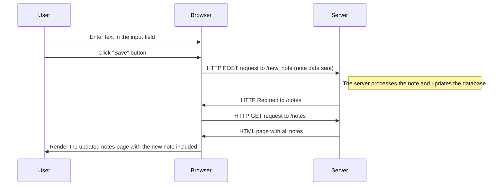

```mermaid
    sequenceDiagram
    participant User
    participant Browser
    participant Server

    User->>Browser: Enter text in the input field
    User->>Browser: Click "Save" button
    Browser->>Server: HTTP POST request to /new_note (note data sent)
    Note right of Server: The server processes the note and updates the database.
    Server->>Browser: HTTP Redirect to /notes
    Browser->>Server: HTTP GET request to /notes
    Server->>Browser: HTML page with all notes
    Browser->>User: Render the updated notes page with the new note included
```
