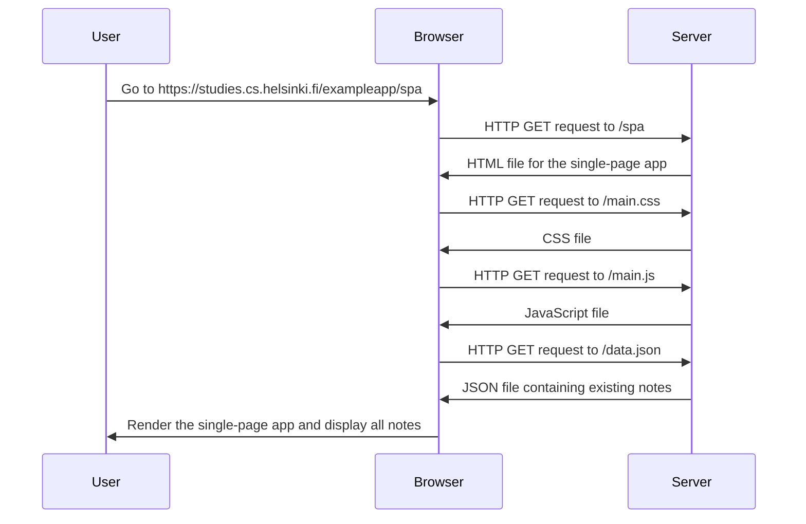

```mermaid
sequenceDiagram
    participant User
    participant Browser
    participant Server

    User->>Browser: Go to https://studies.cs.helsinki.fi/exampleapp/spa
    Browser->>Server: HTTP GET request to /spa
    Server->>Browser: HTML file for the single-page app
    Browser->>Server: HTTP GET request to /main.css
    Server->>Browser: CSS file
    Browser->>Server: HTTP GET request to /main.js
    Server->>Browser: JavaScript file
    Browser->>Server: HTTP GET request to /data.json
    Server->>Browser: JSON file containing existing notes
    Browser->>User: Render the single-page app and display all notes
```
