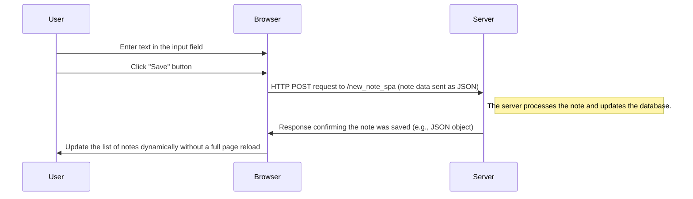

```mermaid
sequenceDiagram
    participant User
    participant Browser
    participant Server

    User->>Browser: Enter text in the input field
    User->>Browser: Click "Save" button
    Browser->>Server: HTTP POST request to /new_note_spa (note data sent as JSON)
    Note right of Server: The server processes the note and updates the database.
    Server->>Browser: Response confirming the note was saved (e.g., JSON object)
    Browser->>User: Update the list of notes dynamically without a full page reload
```
