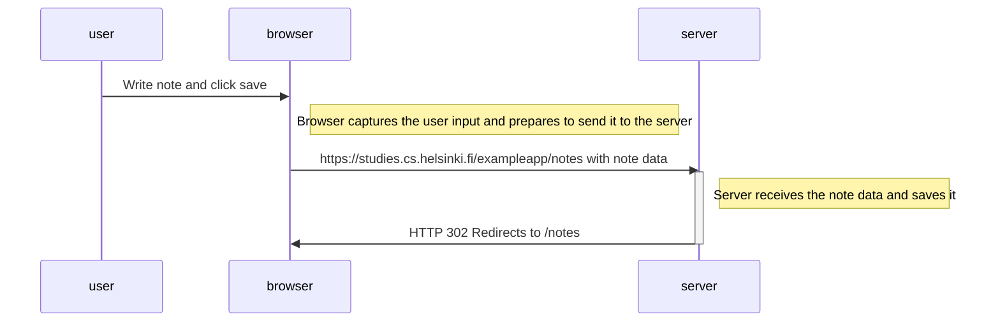

```mermaid
sequenceDiagram
    participant user
    participant browser
    participant server

    user->>browser: Write note and click save
    Note right of browser: Browser captures the user input and prepares to send it to the server

    browser->>server: https://studies.cs.helsinki.fi/exampleapp/notes with note data

    activate server
    Note right of server: Server receives the note data and saves it
    server->>browser: HTTP 302 Redirects to /notes
    deactivate server
```
